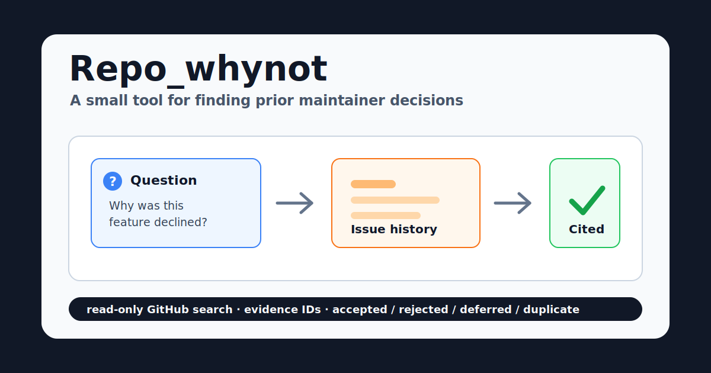

# RepoOps Maintainer Agent



RepoOps is a local-first, read-only maintainer assistant. The current v0.3 focus is narrow:
answering "why not?" questions by finding prior maintainer decisions in repository history.

It is not trying to be a fully autonomous coding agent. The workflow stays explicit,
bounded, observable, and testable.

## What It Does

RepoOps helps answer questions like:

- "Why not use argparse internally?"
- "Can this project support HTML output?"
- "Was this feature already rejected?"
- "Is there an old issue that explains the maintainer position?"

The v0.3 investigator searches closed GitHub issues, grades evidence, and returns a
structured `PriorDecisionResult` with cited thread numbers, confidence, status, facts,
inferences, and uncertainties.

## Why This Exists

General coding agents are good at reading code. Maintainers also need a different kind of
memory: prior decisions, rejected proposals, duplicate threads, and nuanced project policy
that lives in old issues.

RepoOps is valuable when a contributor or maintainer wants to know whether an idea has
history before opening a new issue or PR.

## Safety Model

- Read-only GitHub issue search.
- No comments, labels, closes, pushes, or GitHub mutations.
- No arbitrary shell tool in the workflow.
- Tool loops are capped and configurable.
- All LLM nodes have deterministic fallback behavior.
- Final answers distinguish supported facts, inferences, and uncertainties.

## Quick Start

```bash
uv sync
cp .env.example .env
```

For deterministic local behavior without API calls, keep:

```text
REPOOPS_MODEL_PROVIDER=none
REPOOPS_ENABLE_LLM_SYNTHESIS=false
```

To enable LLM-assisted planning and synthesis:

```text
REPOOPS_MODEL_PROVIDER=openai
REPOOPS_MODEL_NAME=gpt-5.4-mini
REPOOPS_OPENAI_API_KEY=...
REPOOPS_ENABLE_LLM_SYNTHESIS=true
```

For GitHub search:

```text
REPOOPS_GITHUB_TOKEN=...
```

## Try The Why-Not Investigator

```bash
uv run repoops why-not \
  --repo pallets/click \
  --question "Why not use argparse internally?" \
  --investigate
```

You can also ingest closed issues into a local JSONL cache:

```bash
uv run repoops github ingest --repo pallets/click --limit 100
uv run repoops why-not --repo pallets/click --question "Why not use argparse internally?"
```

## Compare Against Naive GitHub Search

```bash
uv run python evals/why_not/compare_search.py
```

Current seed benchmark:

```text
Cases: 9
Baseline top-1: 33.3% (2/6)
Baseline top-3: 50.0% (3/6)
RepoOps top-1: 100.0% (6/6)
RepoOps top-3: 100.0% (6/6)
Baseline unknown accuracy: 100.0% (3/3)
RepoOps unknown accuracy: 100.0% (3/3)
```

This is a small eval, not a broad claim. It is useful because it tests the product thesis:
query planning and evidence grading can recover prior decisions that plain issue search
misses.

## v0.2 Repo QA Workflow

The broader repo QA path still exists:

```text
intent_router
  -> query planner
  -> retrieve
  -> evidence merge
  -> evidence grader
  -> tool planner
  -> controlled read-only tool loop
  -> evidence-grounded final synthesis
  -> action gate
```

Example:

```bash
uv run repoops index --repo-path ./data/fixtures/sample_repo --repo-id sample/repo
uv run repoops ask --repo-id sample/repo --question "How does authentication handle token refresh?"
uv run repoops triage --repo-id sample/repo --issue-file ./data/samples/issue_auth_bug.md
```

## API

```bash
uv run uvicorn app.main:app --reload
```

```bash
curl http://127.0.0.1:8000/health
curl -X POST http://127.0.0.1:8000/query \
  -H 'content-type: application/json' \
  -d '{"repo_id":"sample/repo","task_type":"repo_qa","question":"Where is refresh implemented?"}'
```

## Development

```bash
uv run ruff check .
uv run pytest
```

Project-generated caches live under `data/indexes/` and `data/github/` and are ignored by
git, except for placeholder files and sample fixtures.
